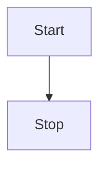
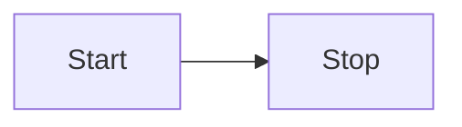
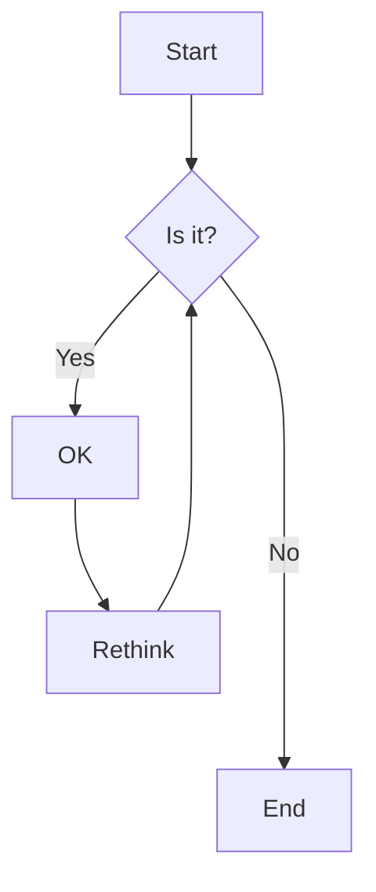
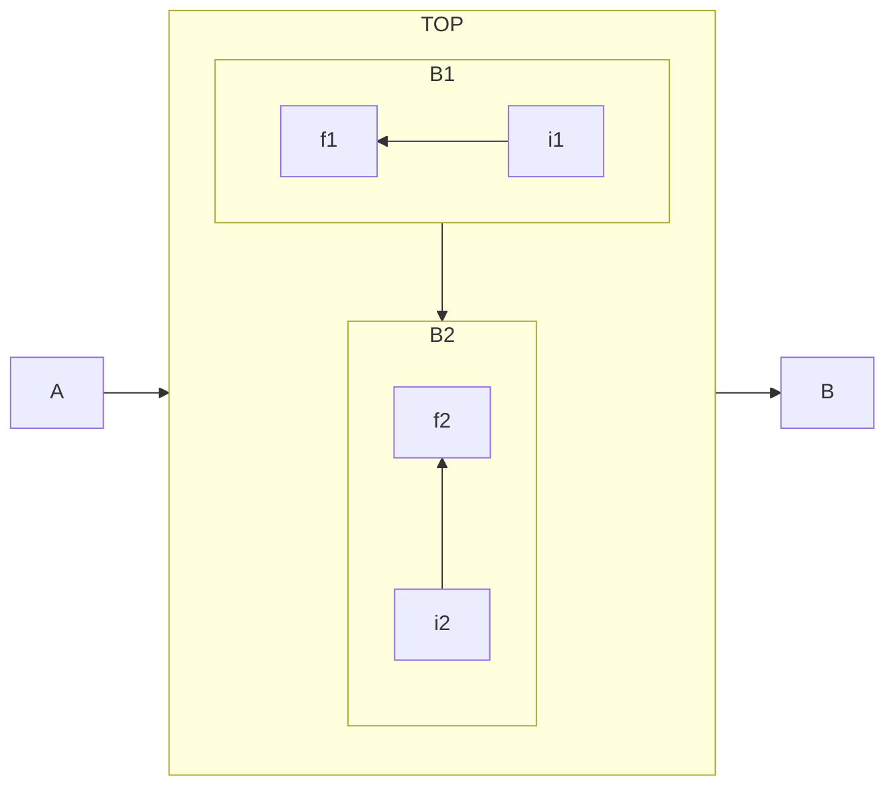
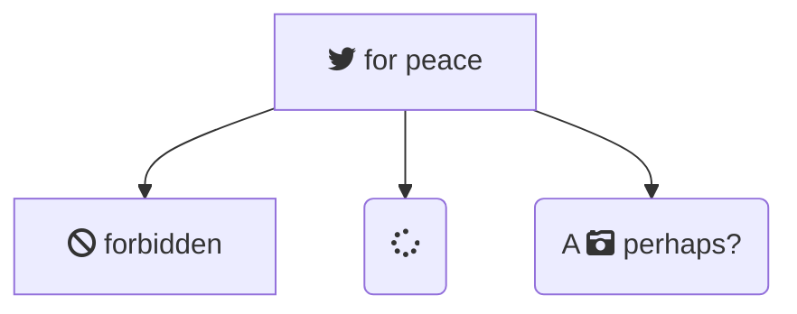
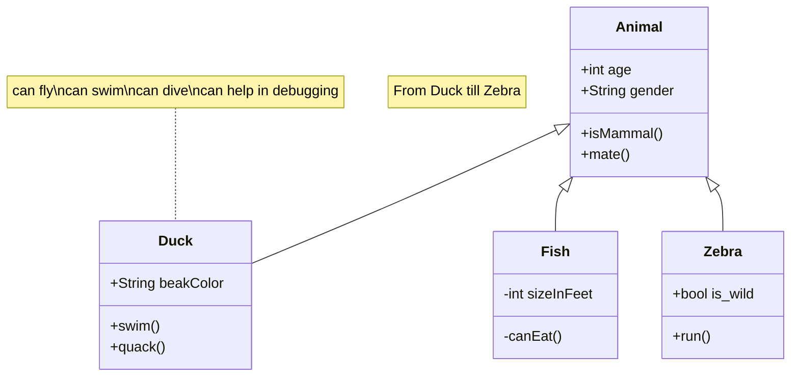
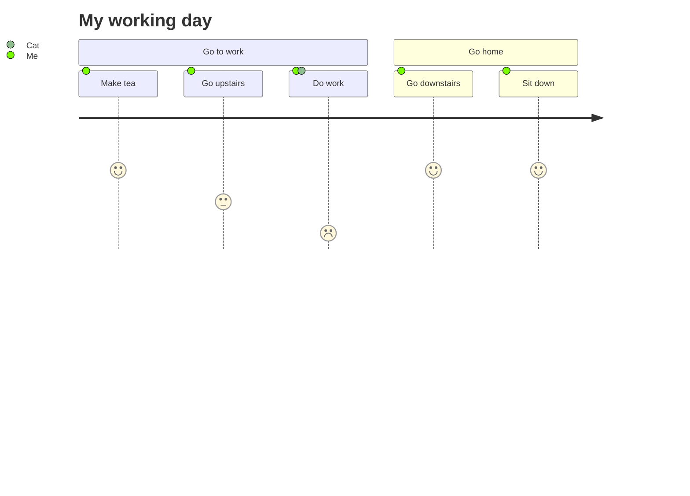
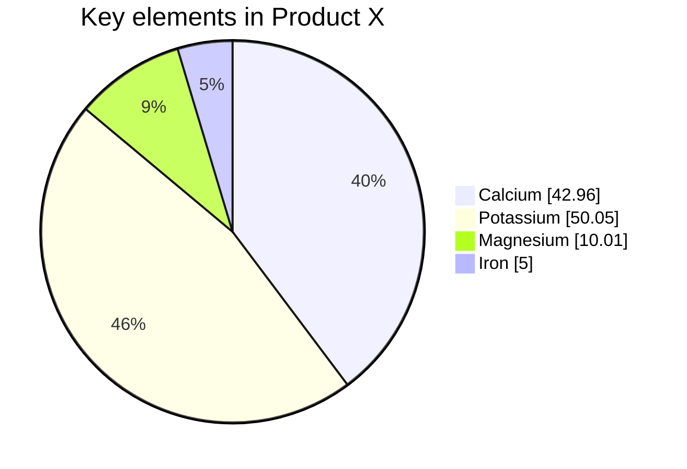
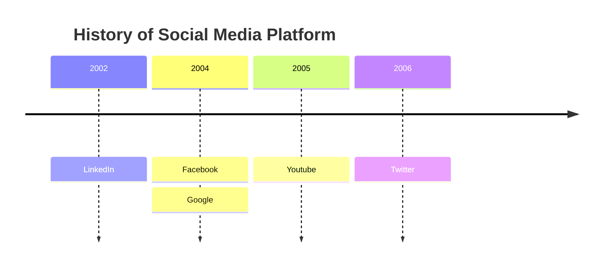

# Using Mermaid for a flow chart











# Class Diagrams



# User Journey


# Pie chart


# Mind Map
(not working)
```mermaid
root((mindmap))
	Origins
      Long history
      ::icon(fa fa-book)
      Popularisation
        British popular psychology author Tony Buzan
    Research
      On effectiveness<br/>and features
      On Automatic creation
        Uses
            Creative techniques
            Strategic planning
            Argument mapping
    Tools
      Pen and paper
      Mermaid
```

# Timeline
(not working)

